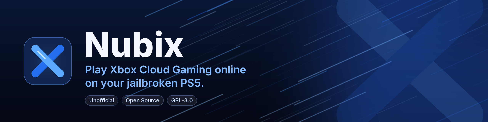

<p align="center">
  
</p>

An **unofficial**, open-source client for **Xbox Cloud Gaming** on jailbroken PS5 consoles.
It runs as a homebrew app (ELF payload) started from the
[websrv](https://github.com/ps5-payload-dev/websrv) Homebrew Launcher and streams cloud games
to your TV with a DualSense as the controller.

> **Not affiliated with, endorsed by, or sponsored by Microsoft or Sony.** "Xbox", "Xbox Cloud
> Gaming" and "Game Pass" are trademarks of Microsoft; "PlayStation" and "PS5" are trademarks of
> Sony Interactive Entertainment. They are used here only to describe what this software works with.
> Read [Disclaimer](#disclaimer) before you sign in.

## Status

| Area | State |
|---|---|
| Microsoft sign-in (code + QR, no browser on the console) | ✅ works on PS5 |
| Cloud library (Game Pass, owned, free-to-play), filters, box art | ✅ works on PS5 |
| Queue / waiting for a server | ✅ works on PS5 |
| Cloud streaming (video, audio, controller, rumble) | ✅ works on PS5 |
| Remote play of your own Xbox console (xHome) | ⚠️ implemented, not tested |
| Native PS5 title / home-screen tile | ❌ not supported (start it from the websrv launcher) |

Video is decoded in software (FFmpeg). If the picture stutters, set the resolution to 720p.

## Requirements

- A jailbroken PS5 that can run ELF payloads (`elfldr` on port 9021) and the
  [websrv](https://github.com/ps5-payload-dev/websrv) Homebrew Launcher.
- A Microsoft account with a Game Pass plan that includes cloud gaming (Essential, Premium or
  Ultimate, depending on your region), or access to the free, ad-supported cloud offering.
- A wired connection or good 5 GHz Wi-Fi.
- A protective DNS that blocks Sony's servers (see [below](#before-you-go-online-protective-dns)).

## Before you go online: protective DNS

**Do this before your jailbroken PS5 connects to the internet for the first time.** A jailbroken
console must never reach Sony's servers: it could download a system update (which can remove the
jailbreak for good) and it reports to Sony. Nubix itself needs the internet, so you cannot simply
cut the connection. Instead, point the PS5 at a DNS server that only lets through what you allow.

### The included DNS server: `tools/sony_dns.py`

[`tools/sony_dns.py`](tools/sony_dns.py) (Python 3.8+, no extra packages) works in **allowlist mode**:

- **Everything is blocked by default.**
- Allowed are only the domains Nubix needs for Xbox Cloud Gaming:
  `login.microsoftonline.com`, `login.live.com`, `xboxlive.com`, `displaycatalog.mp.microsoft.com`,
  `store-images.s-microsoft.com` and `stun.l.google.com` (each with its subdomains).
- **Sony / PlayStation domains are always blocked**, even if you allow them by mistake:
  `playstation.com`, `playstation.net`, `playstation.org`, `sonyentertainmentnetwork.com`,
  `scea.com`, `sbdnpd.com`, `ribob01.net`.
- If you want the PS5 to reach anything else, add the domain to
  [`tools/allowlist.txt`](tools/allowlist.txt) (one per line). **You are responsible for every
  domain you add.**

Run it on a PC in the same network as the PS5:

```
python tools\sony_dns.py          (Windows, terminal opened with "Run as administrator")
sudo python3 tools/sony_dns.py    (macOS / Linux)
```

It prints the IP address to enter on the PS5. On Windows, allow Python through the firewall for
**private networks** when asked, otherwise the PS5's queries never arrive. The PC has to stay on
while the PS5 is online, so give it a fixed IP in your router.

Useful options:
- `--log-all` shows every query the PS5 makes (ALLOW / BLOCK), so you can see what to add.
- `--allow example.com` allows a domain without editing the file.
- `--map host=IP` answers a name with a fixed address, for example if your jailbreak method
  redirects `manuals.playstation.net` to your own exploit host. This works even for Sony names.
- `--upstream 9.9.9.9` uses another upstream DNS (default `1.1.1.1`).

### On the PS5

*Settings → Network → Settings → Set Up Internet Connection* → your connection →
*Advanced Settings* → *DNS Settings: Manual* → **Primary DNS** = the IP shown by the script,
**Secondary DNS** = the same IP (a public DNS as secondary would bypass the protection).
Never sign in to PSN on the jailbroken console and ignore any update prompt. The PS5's own
"Test Internet Connection" will report a PSN failure with this setup; that is expected.

### Using your own DNS server instead

With Pi-hole, AdGuard Home or NextDNS you can do the same: block all Sony domains listed above
(with subdomains) and ideally allow only the Nubix domains. **Do not** use generic PS5 blocklists
that also block CDNs such as `akamai.net`, `akamaiedge.net`, `akadns.net`, `edgekey.net` or
`edgesuite.net`, and do not set the DNS to `127.0.0.2`: Nubix would no longer be able to sign in,
load your library or stream.

## Installation

1. Download `nubix-v<version>-websrv.zip` (e.g. `nubix-v0.3.0-websrv.zip`) from the releases page.
2. Unzip it and copy the `nubix` folder to `/data/homebrew/` on the PS5 (FTP, or a USB drive
   under `/mnt/usb0/homebrew/`). You should end up with
   `/data/homebrew/nubix/{eboot.elf, homebrew.js, sce_sys/icon0.png, assets/}`.
3. Start websrv, open the Homebrew Launcher (the launcher PKG on the PS5, or
   `http://<ps5-ip>:8080` from a phone or PC) and start **Nubix**.
   *Start (verbose log)* writes a detailed log for troubleshooting.

To update, replace the folder. Your sign-in and settings are kept in `/data/nubix/`.

## First start

The app shows a code and a QR code. Open **https://www.microsoft.com/link** on your phone or PC
(or scan the QR code), enter the code and sign in. The app then stores a refresh token, so you
only do this once.

Library tabs: **Cloud library**, **My consoles**, **Settings** (switch with L1/R1).
△ cycles the filter: *All games*, *Game Pass*, *Owned* and *Free to play*.

## Controls

The PS5 system keeps the PS and Create buttons to itself, so the app never sees them.

| DualSense | Xbox controller |
|---|---|
| ✕ / ○ / □ / △ | A / B / X / Y |
| L1 / R1, L2 / R2, L3 / R3 | LB / RB, LT / RT, LS / RS |
| Options | Menu |
| Touchpad click | View |
| Hold **Options + touchpad** for 1 s | Stream menu (resume, Xbox button, statistics, refresh video, disconnect) |

In the menus: ✕ = select, ○ = back, L1/R1 = switch tabs, △ = filter.

## Settings

- **Stream resolution**: 720p, 1080p, 1080p (high quality). 720p decodes fastest.
- **Maximum bitrate**: 5–20 Mbps. Lower it on Wi-Fi or if the picture stutters.
- **Server region**: automatic or one of the regions Xbox offers your account.
- **Free-to-play fallback**: retry with the ad-supported offering when a title is not in your plan.
- **Extra stick deadzone**, **stream statistics**, **sign out**.

## Network behaviour

Nubix talks to the same Microsoft services as the Xbox web player, and paces itself
(`src/core/ratelimit.*`):
- at most 5 requests per second per Microsoft host;
- on HTTP 429 it waits for `Retry-After` (or backs off 2 → 120 s) and only repeats read-only requests;
- at most 4 cloud session starts per 5 minutes;
- the library is cached for 6 hours and box art permanently (`/data/nubix/cache/`); △ on *My consoles* reloads the console list.

## Troubleshooting

- Log: `/data/nubix/log.txt` (also viewable at `http://<ps5-ip>:8080/fs/data/nubix/log.txt`).
  Start with *Start (verbose log)* for more detail.
- Stutter or growing delay: 720p and/or a lower bitrate; prefer a wired connection.
- "No cloud gaming access": your account has no plan with cloud gaming in your region.
- Sign-in, library or box art fail only with the protective DNS: start `tools/sony_dns.py --log-all`
  and look for BLOCK lines while Nubix loads; please report them so the built-in list can be fixed.
- Close other running homebrew before starting Nubix (websrv can crash otherwise).

## Privacy and security

- Your password never reaches the app: sign-in uses Microsoft's device-code flow.
- The refresh token is stored **unencrypted** in `/data/nubix/config.json`. Anyone with
  file access to the console (for example an open FTP payload on your network) can copy it. Do not
  leave FTP running on untrusted networks. *Settings → Sign out* deletes it; you can also sign out of
  all devices in your Microsoft account's security settings.
- The app only contacts Microsoft services (sign-in, Xbox Live, cloud gaming, Microsoft Store catalog)
  plus Google's public STUN server (`stun.l.google.com`) to find its public address for WebRTC.

## Disclaimer

This is an unofficial, non-commercial hobby project. Microsoft does not authorise third-party clients. Using unofficial clients may violate the Microsoft
Services Agreement and Xbox terms of use, and running homebrew may violate Sony's terms. Your account
or console could be restricted. **Use it at your own risk**, ideally first with a Microsoft account you could afford to lose. The software is provided without any
warranty (see `LICENSE`). Do not use it to circumvent paywalls, regional restrictions or copy protection;
it only streams what your own account is entitled to.

## Building from source

Release builds are made by GitHub Actions: pushing a tag `vX.Y.Z` (matching the version in
`CMakeLists.txt`) runs `.github/workflows/release.yml`, which builds the PS5 zip and the
corresponding-source archive and attaches both to the GitHub release. Every push also builds and
tests the host version on macOS (`.github/workflows/ci.yml`).

To build locally: Docker is required for the PS5 build; the host build (macOS/Linux) is for development and testing.

```sh
# host (macOS): brew install cmake pkg-config sdl2 sdl2_ttf ffmpeg opus openssl@3
scripts/build-deps.sh host && scripts/build-host.sh --test   # host app, xc-cli, unit tests
scripts/build-deps.sh ps5  && scripts/build-ps5.sh           # build-ps5/nubix.elf + dist/nubix/
PS5_HOST=<ip> scripts/deploy.sh install|run|log              # FTP install, send to elfldr, fetch log
```

Developer tools:
- `nubix --selftest` brings up every subsystem headless
  (`SDL_VIDEODRIVER=dummy SDL_AUDIODRIVER=dummy`) and exits 0 on success.
- `xc-cli` (host) drives the services without UI: `login`, `status`, `titles`, `consoles`,
  `play <titleId>`, `stream cloud <titleId> [seconds]`.
- Protocol implementation: `src/core/` (sign-in, catalog, session API, input/message protocol) and
  `src/stream/` (WebRTC, RTP/RTCP, decoding, session state machine).

## Credits

Nubix stands on the shoulders of the projects that documented the Xbox cloud streaming protocol:
[green-nx](https://github.com/rmrf404/green-nx), [GreenOvercast](https://github.com/Producdevity/GreenOvercast),
[Greenlight](https://github.com/unknownskl/greenlight), [xbox-xcloud-player](https://github.com/unknownskl/xbox-xcloud-player),
[xal-node](https://github.com/unknownskl/xal-node), [XStreaming](https://github.com/Geocld/XStreaming),
[green-vita](https://github.com/Day-OS/green-vita), and on the PS5 homebrew work of
[ps5-payload-dev](https://github.com/ps5-payload-dev) (SDK, websrv, SDL2 port) and
[ProsperoLight](https://github.com/xEasy4Breezy/ProsperoLight).

## License

**GPL-3.0-only** (see [`LICENSE`](LICENSE)). Parts of the code are derived from
[green-nx](https://github.com/rmrf404/green-nx) (GPL-3.0) and
[GreenOvercast](https://github.com/Producdevity/GreenOvercast) (MPL-2.0); the affected files say so in
their headers. Third-party components, their licenses and copyright notices:
[`THIRD_PARTY_NOTICES.md`](THIRD_PARTY_NOTICES.md) and [`THIRD_PARTY_LICENSES.txt`](THIRD_PARTY_LICENSES.txt).

**Source code for binary releases.** Every release zip is accompanied on the same release page by
`nubix-v<version>-corresponding-source.tar.xz`, which contains the complete corresponding source of
everything linked into `eboot.elf` (built with `scripts/make-source-bundle.sh`). See `SOURCE.txt` in the
zip for exact component versions.
